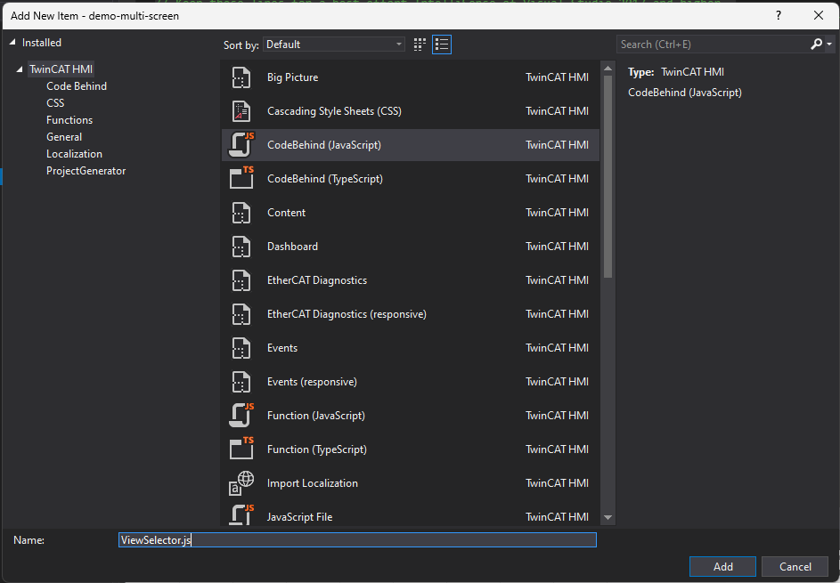
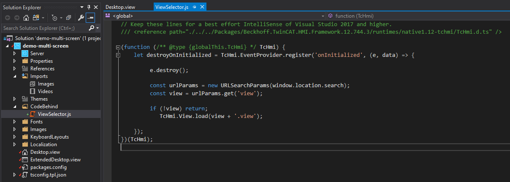
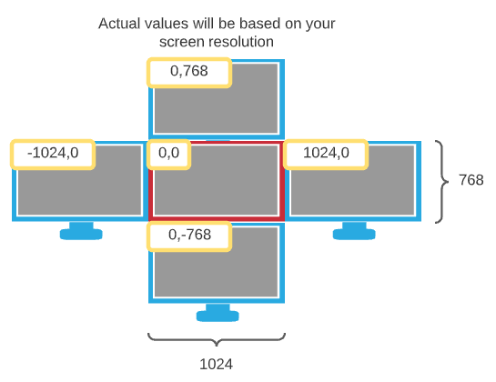

# Example using TcHmi on IPC with multiple screens (or multiple clients accessing different screens)

## Disclaimer
This guide is a personal project and not a peer-reviewed publication or sponsored document. It is provided “as is,” without any warranties—express or implied—including, but not limited to, accuracy, completeness, reliability, or suitability for any purpose. The author(s) shall not be held liable for any errors, omissions, delays, or damages arising from the use or display of this information.

All opinions expressed are solely those of the author(s) and do not necessarily represent those of any organization, employer, or other entity. Any assumptions or conclusions presented are subject to revision or rethinking at any time.

Use of this information, code, or scripts provided is at your own risk. Readers are encouraged to independently verify facts. This content does not constitute professional advice, and no client or advisory relationship is formed through its use.

## Overview

Typically an IPC will have a single screen which will be used as a HMI. This will require, starting a browser in kiosk mode, then directing it to TcHmi (typically using a shortcut).

There are applications which will require more than one screen with each screen showing a different view of TcHMI. This project shows you one method to achieve this.

1. Add a code behind javascript which will allow the current view to be selected via a query string passed in the URL.
2. Create two shortcuts to control chrome's startup location.
3. Change the default url in the shortcuts to include the new query string.

This example code can also be used when more than one client needs to access different pages from the server.

## Getting Started

### 1. Additions to your TcHMI project

The code we will add will allow us to replace

```
http://127.0.0.1:1010/
```

with

```
http://127.0.0.1:1010?view=Desktop
```

In this example we have a second view called ExtendedDesktop which can now be accessed by the following,

```
http://127.0.0.1:1010?view=ExtendedDesktop
```

You will need to add the code below, to a "CodeBehind" JavaScript file to your project. Either copy the "ViewSelector.js" from the included project or create a new code behind file and paste in the following code, shown in the steps below.

#### a. The code snippet which does the work

```javascript
const urlParams = new URLSearchParams(window.location.search);
const view = urlParams.get("view");

if (!view) return;
TcHmi.View.load(view + ".view");
```

#### b. Creating the code behind file



#### c. The complete code once added to the code behind file.



At this point you project is now able to accept queries passed in via the location bar.

### 2. Create two shortcuts

Shortcut 1 (Main screen)

```
"C:\Program Files (x86)\Google\Chrome\Application\chrome.exe" --new-window "http://localhost:1010" --window-size="1024,768" --window-position="0,0" --kiosk --user-data-dir="C:/temp/Profiles/1"
```

Shortcut 2 (Second screen)

```
"C:\Program Files (x86)\Google\Chrome\Application\chrome.exe" --new-window "http://localhost:1010" --window-size="1024,768" --window-position="-1024,0" --kiosk --user-data-dir="C:/temp/Profiles/2"
```

Please note that you will need to set the second window-position so that it correctly sits on your second screen.

```
--window-position="-1024,0"
```

This may require setting a positive or negative position depending on which side the second screen is placed.



It is also important to set the two profiles to different values as the window position is stored here.

### 3. Change the default url

Shortcut 1 (Main screen)

```
"C:\Program Files (x86)\Google\Chrome\Application\chrome.exe" --new-window "http://localhost:1010?view=Desktop" --window-size="1024,768" --window-position="0,0" --kiosk --user-data-dir="C:/temp/Profiles/1"
```

Shortcut 2 (Second screen)

```
"C:\Program Files (x86)\Google\Chrome\Application\chrome.exe" --new-window "http://localhost:1010?view=ExtendedDesktop" --window-size="1024,768" --window-position="-1024,0" --kiosk --user-data-dir="C:/temp/Profiles/2"
```

You can request any view simply by changing the value. It must match the name of a view in your TcHmi Project.

## TwinCAT

This project uses TcXaeShell 3.1.4024.55 and TwinCAT HMI 1.12.762.42

## Licenses

TwinCAT HMI will allow multiple browsers to connect using a single client license if they have the same IP address. Therefore at the time of writing this is possible with the standard TF2000 license only.
