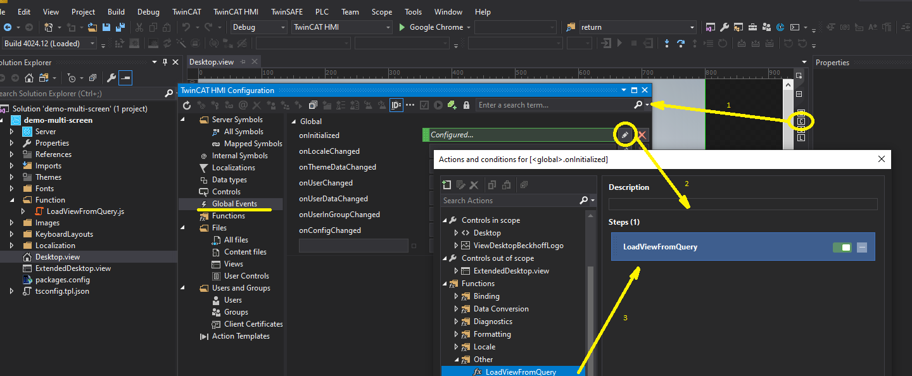

# Example using TcHmi on IPC with multiple screens

## Disclaimer
This is a personal guide not a peer reviewed journal or a sponsored publication. We make
no representations as to accuracy, completeness, correctness, suitability, or validity of any
information and will not be liable for any errors, omissions, or delays in this information or any
losses injuries, or damages arising from its display or use. All information is provided on an as
is basis. It is the reader’s responsibility to verify their own facts.

The views and opinions expressed in this guide are those of the authors and do not
necessarily reflect the official policy or position of any other agency, organization, employer or
company. Assumptions made in the analysis are not reflective of the position of any entity
other than the author(s) and, since we are critically thinking human beings, these views are
always subject to change, revision, and rethinking at any time. Please do not hold us to them
in perpetuity.

## Overview 
Typically an IPC will have a single screen which will be used as a HMI.  This will require, starting a browser in kiosk mode, then directing it to TcHmi (typically using a shortcut).  

There are applications which will require more than one screen with each screen showing a different view of TcHMI.  This project shows you one method to achieve this.   

1. Add a function which will allow the current view to be selected via a query string passed in the URL. 
2. Create two shortcuts to control chrome's startup location.
3. Change the default url in the shortcuts to include the new query string.


## Getting Started 

### 1. Additions to your TcHMI project

The code we will add will allow us to replace

```
http://127.0.0.1:1010/
```
with
```
http://127.0.0.1:1010?view=Desktop
```
In this example we have a second view called ExtendedDesktop which can now be accessed by the following,
```
http://127.0.0.1:1010?view=ExtendedDesktop
```

You will need to add the function LoadViewFromQuery.js to your project.  Either copy the function from the included project or create a new function called LoadViewFromQuery() and paste in the following code.  Note that the function does not take or return any values.   

```javascript 
var view = GetQueryParameter('view');

if (!view) return;

TcHmi.View.load(view + '.view', function (data) {});

function GetQueryParameter(parameterName) {

    var href = window.location.href;
    var name = parameterName.replace(/[\[\]]/g, '\\$&');
    var regex = new RegExp('[?&]' + name + '(=([^&#]*)|&|#|$)'), value = regex.exec(href);

    if (!value) return null;
    if (!value[2]) return null;

    return decodeURIComponent(value[2].replace(/\+/g, ' '));

}
```
Once done you should navigate to the Server Configuration page (1) > Events > OnInitialized (2) and add this function as a call (3).  



At this point you project is now able to accept queries passed in via the location bar.  

### 2. Create two shortcuts

Shortcut 1 (Main screen)

```
"C:\Program Files (x86)\Google\Chrome\Application\chrome.exe" --new-window "http://localhost:1010" --window-size="1024,768" --window-position="0,0" --kiosk --user-data-dir="C:/temp/Profiles/1"
```

Shortcut 2 (Second screen)

```
"C:\Program Files (x86)\Google\Chrome\Application\chrome.exe" --new-window "http://localhost:1010" --window-size="1024,768" --window-position="-1024,0" --kiosk --user-data-dir="C:/temp/Profiles/2"
```

Please note that you will need to set the second window-position so that it correctly sits on your second screen.  

```
--window-position="-1024,0"
```
This may require setting a positive or negative position depending on which side the second screen is placed.  

It is also important to set the two profiles to different values as the window position is stored here. 

### 3. Change the default url

Shortcut 1 (Main screen)

```
"C:\Program Files (x86)\Google\Chrome\Application\chrome.exe" --new-window "http://localhost:1010?view=Desktop" --window-size="1024,768" --window-position="0,0" --kiosk --user-data-dir="C:/temp/Profiles/1"
```

Shortcut 2 (Second screen)

```
"C:\Program Files (x86)\Google\Chrome\Application\chrome.exe" --new-window "http://localhost:1010?view=ExtendedDesktop" --window-size="1024,768" --window-position="-1024,0" --kiosk --user-data-dir="C:/temp/Profiles/2"
```

You can request any view simply by changing the value.  It must match the name of a view in your TcHmi Project.  

## TwinCAT
This project uses TcXaeShell 3.1.4024.12 and TwinCAT HMI 1.12.744.3

## Licenses 
TwinCAT HMI will allow multiple browsers to connect using a single client license if they have the same IP address.  Therefore at the time of writing this is possible with the standard TF2000 license only.  